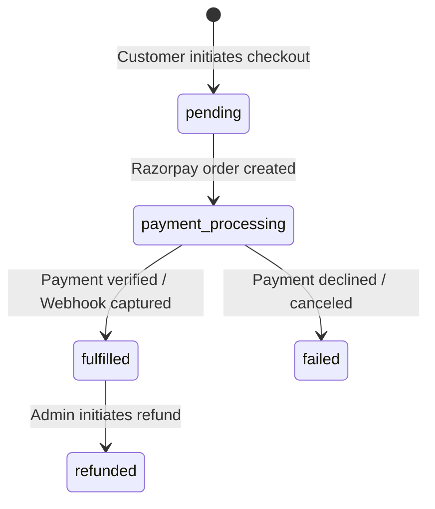

# BENZWELL — Razorpay Payment Architecture & Webhooks

## 1. Checkout State Machine

The order lifecycle transitions through the following trusted server states:

---

## 2. Server-Authoritative Checkout Process

1. **Cart Submission:** Client submits product IDs, requested quantities, and coupon code.
2. **Server Price Calculation:** `createCheckoutOrder` fetches authoritative prices from `products` table and computes total in paise (`amount * 100`).
3. **Razorpay Order Initialization:** Order is registered with Razorpay API, and `razorpay_order_id` is saved with status `payment_processing`.
4. **Checkout Modal:** The Razorpay modal opens on the client using the public Key ID.
5. **Client Signature Callback:** On completion, Razorpay returns `razorpay_order_id`, `razorpay_payment_id`, and `razorpay_signature`.
6. **Server Signature Verification:** `verifyPaymentAndFulfillOrder` verifies the HMAC SHA-256 signature using `RAZORPAY_KEY_SECRET`.
7. **Fulfillment:** Order is marked `fulfilled`, `customer_entitlements` records are granted, and confirmation email is dispatched via Resend.

---

## 3. Webhook Idempotency & Verification

Endpoint: `/api/webhooks/razorpay`

1. The raw payload is verified against the `x-razorpay-signature` header using `RAZORPAY_WEBHOOK_SECRET`.
2. The event ID is checked in `razorpay_webhook_events`. If duplicate, 200 OK is returned immediately.
3. For `order.paid` or `payment.captured` events, the order is fulfilled if not already processed by the client callback.
